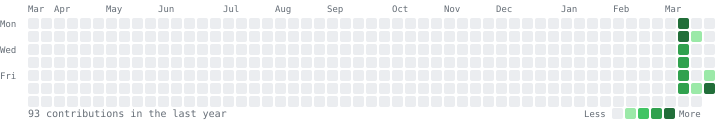

# Hi there 👋 I'm Bruno

IT and Linux hobbyist based in Helsinki 🇫🇮.  
I learn by building things — most of what's here is me figuring stuff out as I go.

- 🌱 Studying IT at [UAb](https://www.uab.pt) and working through Linux system administration (RHCSA track)
- 🔨 I tinker with Python scripts, bash, and C as part of my coursework and self-study
- 🐧 Daily Arch Linux / Hyprland user — most of my projects come from solving problems on my own setup
- 🌐 Website: [bgonc.codeberg.page](https://bgonc.codeberg.page)
- 📬 Contact: [bgonc.codeberg.page](https://bgonc.codeberg.page) (contact form on the site)

---

---

## Projects

### 🖥️ [System Dashboard](https://codeberg.org/bgonc/system-dashboard)

A PyQt6 desktop dashboard that monitors my Arch Linux system in real time.  
CPU, RAM, network I/O, battery, systemd service health, kernel alerts, Filen cloud sync status, and package updates — all in a dark glassmorphism UI.

Built to scratch a personal itch: a single-glance panel for my Hyprland setup without running a browser or an Electron app.

→ [codeberg.org/bgonc/system-dashboard](https://codeberg.org/bgonc/system-dashboard)

**Stack:** Python · PyQt6 · systemd · journalctl · psutil  
**License:** GPL-3.0

---

### 📊 [Excel Utils](https://bgonc.codeberg.page/excel-utils)

A browser-based tool for combining, filtering, and reshaping Excel and CSV exports.  
Everything runs client-side — no server, no uploads.

Live at 👉 **[bgonc.codeberg.page/excel-utils](https://bgonc.codeberg.page/excel-utils)**  
Source: [codeberg.org/bgonc/excel-utils](https://codeberg.org/bgonc/excel-utils)

**Stack:** HTML · CSS · Vanilla JavaScript · SheetJS  
**License:** MIT

---

### 🏃 [Polar AI Coach](https://codeberg.org/bgonc/polar-coach)

AI-powered training coach that connects to Polar watch data.
Readiness scoring, sleep & stress analysis, pace zones, race predictions, interactive HR charts, adaptive training plans, and daily AI coaching with weather awareness.

Built for personal use with a Polar Vantage V3 — runs locally, all data stays on your machine.

→ [codeberg.org/bgonc/polar-coach](https://codeberg.org/bgonc/polar-coach)

**Stack:** Python · Flask · OpenRouter AI · Polar AccessLink API · HTML Canvas
**License:** MIT

---

### 🌐 [Portfolio Website](https://bgonc.codeberg.page)

Personal site built with React, TypeScript, and Vite. Has a project page and a small blog section.  
Deployed via Codeberg Pages.

→ [bgonc.codeberg.page](https://bgonc.codeberg.page)

**Stack:** React · TypeScript · Vite  
**License:** MIT

---

### 🎓 [C Programming Studies](https://codeberg.org/bgonc/C)

Coursework and exercises from my IT studies at UAb, plus some independent practice.  
Covers the basics: control flow, functions, arrays, pointers, file I/O, sorting, and structs.  
Nothing fancy — just working through the fundamentals.

→ [codeberg.org/bgonc/C](https://codeberg.org/bgonc/C)

**License:** MIT

---

## Tools & Tech I use day to day

